# 智慧MOOC教育平台毕业设计系统分析图

## 使用说明

- 本文档基于项目根目录 `README.md`、前端用户端目录 `tj-front/tj-portal-src`、后端微服务模块以及 `sql` 目录中的数据库脚本整理。
- 图形语法统一使用 Mermaid，适合直接粘贴到 Typora、Markdown 编辑器、Mermaid Live Editor 或论文附录中。
- `tj-front` 下的前端说明文档明确写明项目包含“用户端和管理后台”两个部分，但当前工作区中能直接读取到的源码目录主要是 `tj-portal-src`；因此本文中的管理端功能结构结合 `tj-front/README.md`、项目根目录 `README.md` 与后台微服务职责综合归纳。

## 1. 系统总体功能结构图

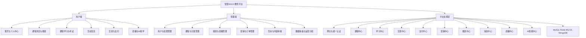

## 2. 用户端功能结构图

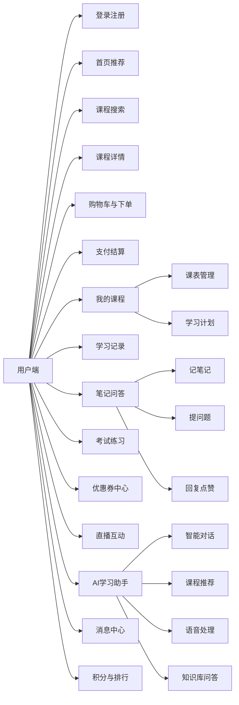

## 3. 管理端功能结构图

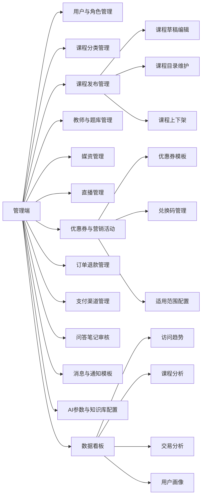

## 4. 系统层次架构图

```mermaid
flowchart TB
    subgraph L1[表现层]
        A1[学生用户]
        A2[教师/管理员]
        A3[用户端前端]
        A4[管理端前端]
    end

    subgraph L2[接入层]
        B1[Nginx]
        B2[Spring Cloud Gateway]
        B3[统一认证与鉴权]
    end

    subgraph L3[业务服务层]
        C1[用户服务]
        C2[课程服务]
        C3[学习服务]
        C4[考试服务]
        C5[搜索服务]
        C6[交易服务]
        C7[支付服务]
        C8[营销服务]
        C9[消息服务]
        C10[互动服务]
        C11[媒资服务]
        C12[直播服务]
        C13[AI服务]
        C14[数据服务]
        C15[ID服务]
    end

    subgraph L4[通用支撑层]
        D1[OpenFeign]
        D2[Auth SDK]
        D3[RabbitMQ]
        D4[Seata]
        D5[Redisson]
        D6[Caffeine]
        D7[XXL-JOB]
        D8[Sentinel]
        D9[Nacos]
    end

    subgraph L5[数据存储层]
        E1[MySQL]
        E2[Redis]
        E3[Elasticsearch]
        E4[MongoDB]
        E5[Qdrant]
    end

    subgraph L6[第三方平台层]
        F1[支付宝/微信支付]
        F2[腾讯云 COS/VOD]
        F3[DashScope/OpenAI]
        F4[Nginx-RTMP]
    end

    A1 --> A3
    A2 --> A4
    A3 --> B1
    A4 --> B1
    B1 --> B2
    B2 --> B3
    B3 --> C1
    B2 --> C2
    B2 --> C3
    B2 --> C4
    B2 --> C5
    B2 --> C6
    B2 --> C7
    B2 --> C8
    B2 --> C9
    B2 --> C10
    B2 --> C11
    B2 --> C12
    B2 --> C13
    B2 --> C14
    B2 --> C15

    C1 --- D1
    C2 --- D1
    C3 --- D1
    C6 --- D3
    C7 --- D3
    C8 --- D3
    C13 --- D3
    C6 --- D4
    C2 --- D5
    C3 --- D6
    C8 --- D7
    C6 --- D8
    C1 --- D9
    C2 --- D9
    C3 --- D9
    C4 --- D9
    C5 --- D9
    C6 --- D9
    C7 --- D9
    C8 --- D9
    C9 --- D9
    C10 --- D9
    C11 --- D9
    C12 --- D9
    C13 --- D9
    C14 --- D9
    C15 --- D9

    C1 --> E1
    C2 --> E1
    C3 --> E1
    C4 --> E1
    C6 --> E1
    C7 --> E1
    C8 --> E1
    C9 --> E1
    C10 --> E1
    C11 --> E1
    C12 --> E1
    C13 --> E1
    C14 --> E1
    C1 --> E2
    C2 --> E2
    C3 --> E2
    C5 --> E3
    C13 --> E4
    C13 --> E5

    C7 --> F1
    C11 --> F2
    C13 --> F3
    C12 --> F4
```

## 5. 微服务架构图

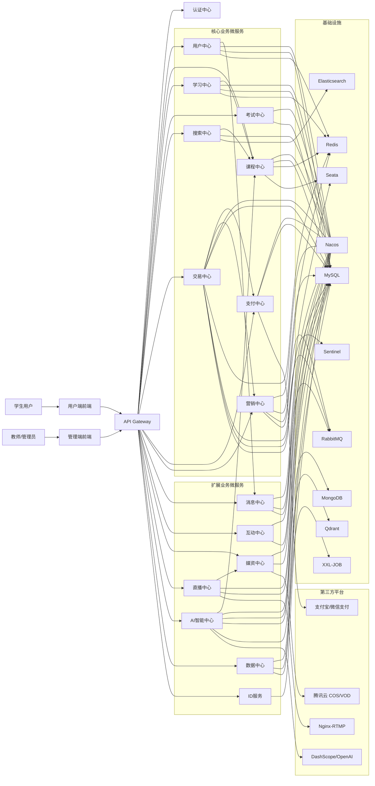

## 6. 顶层数据流图

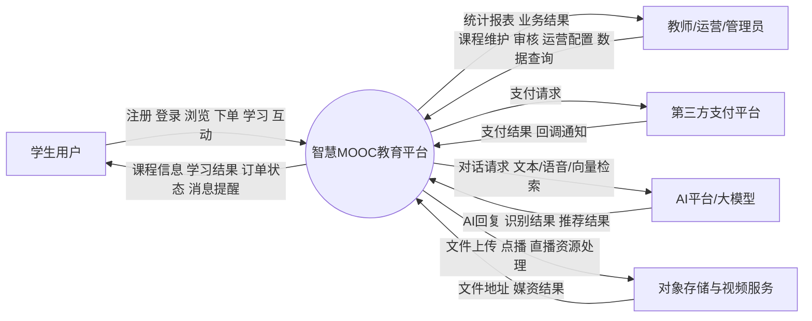

## 7. 第一层数据流图

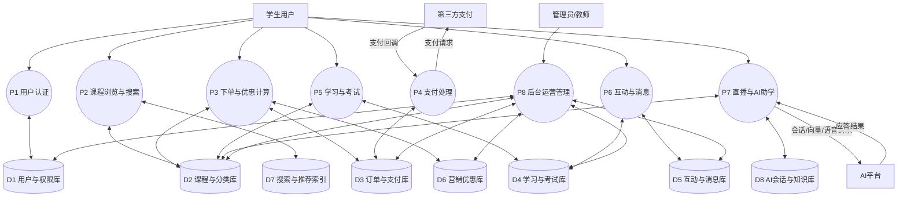

## 8. 第二层数据流图

> 依据分层数据流图设计原则，第一层数据流图中的每一个子模块都应继续展开为对应的第二层数据流图。因此，第一层共有 8 个子模块，这里给出 8 个第二层数据流图。

### 8.1 P1 用户认证子模块数据流图

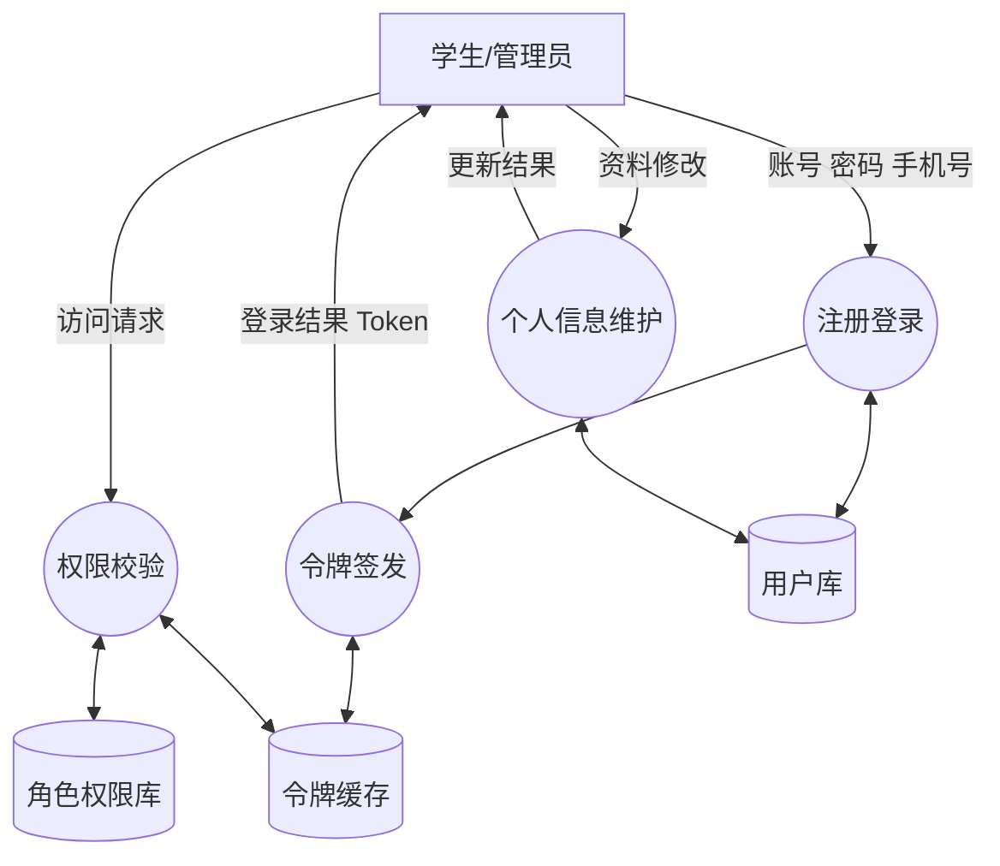

### 8.2 P2 课程浏览与搜索子模块数据流图

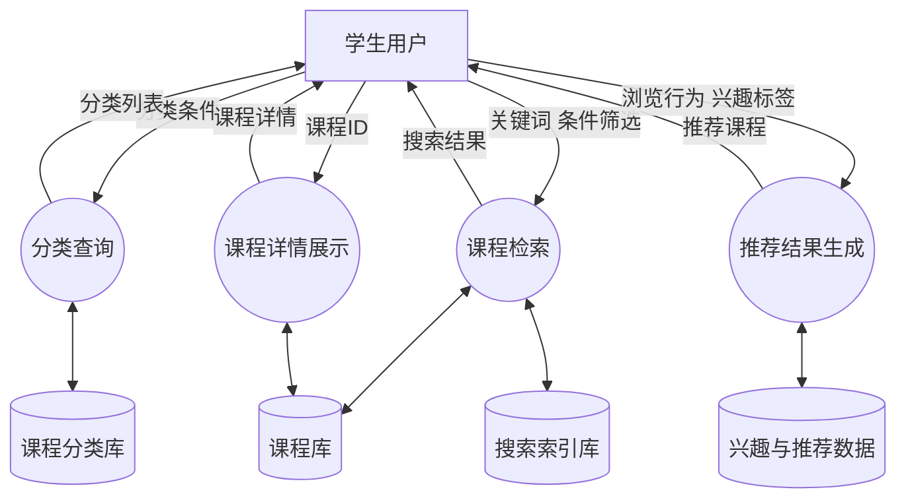

### 8.3 P3 下单与优惠计算子模块数据流图

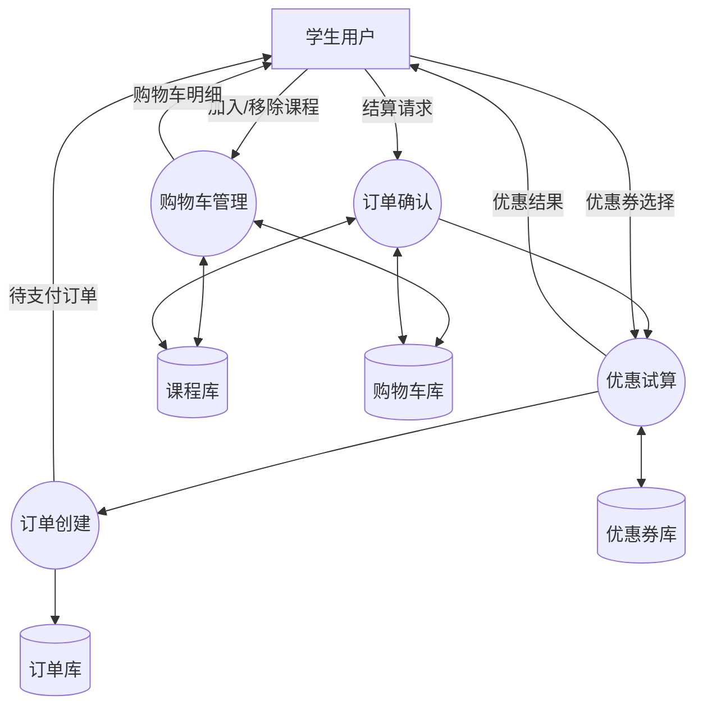

### 8.4 P4 支付处理子模块数据流图

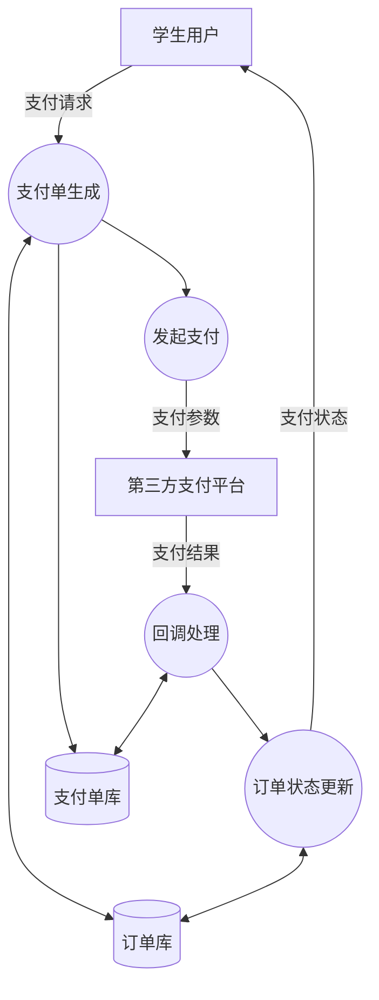

### 8.5 P5 学习与考试子模块数据流图

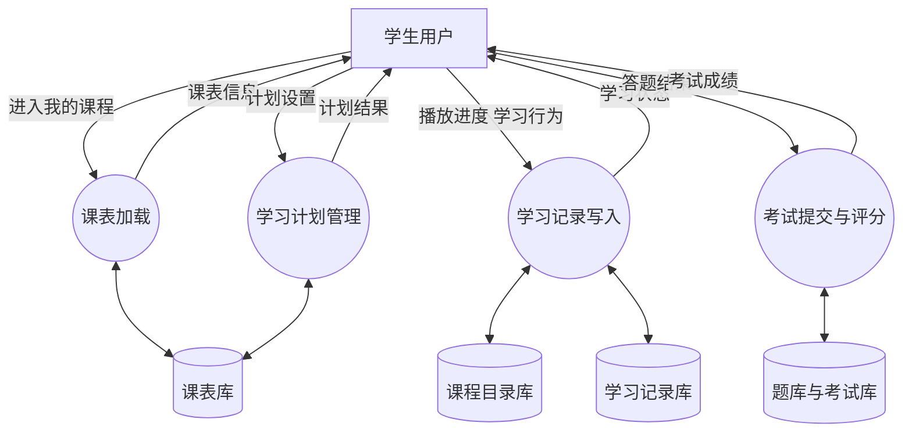

### 8.6 P6 互动与消息子模块数据流图

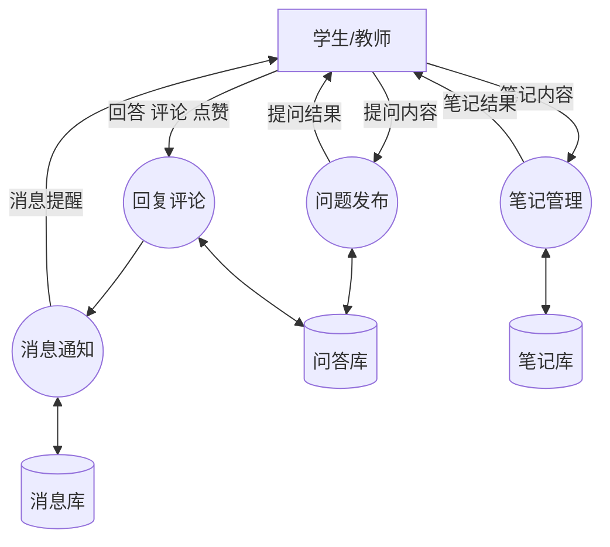

### 8.7 P7 直播与 AI 助学子模块数据流图

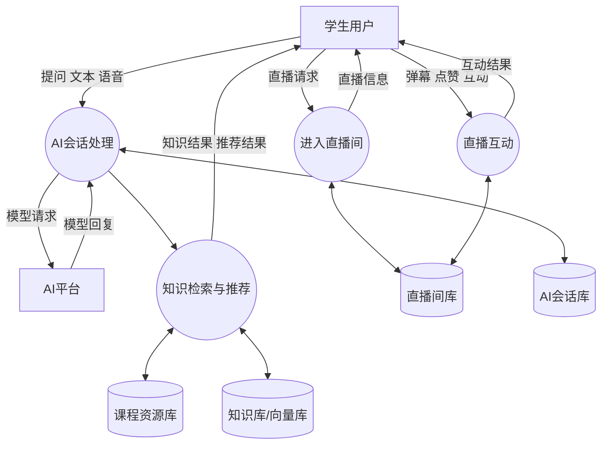

### 8.8 P8 后台运营管理子模块数据流图

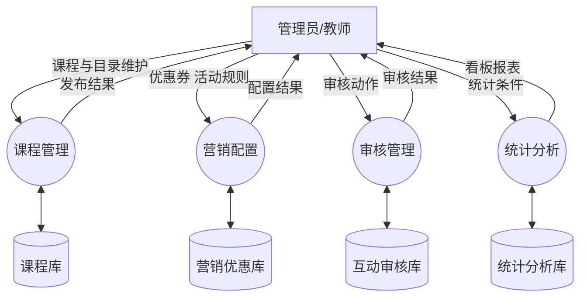

## 9. 数据库 E-R 图

```mermaid
erDiagram
    USER ||--|| USER_DETAIL : has
    USER ||--o{ ACCOUNT_ROLE : owns
    ROLE ||--o{ ACCOUNT_ROLE : binds

    CATEGORY ||--o{ CATEGORY : parent_of
    CATEGORY ||--o{ COURSE : classifies
    COURSE ||--|| COURSE_CONTENT : has
    COURSE ||--o{ COURSE_CATALOGUE : contains
    COURSE ||--o{ COURSE_TEACHER : assigned
    USER ||--o{ COURSE_TEACHER : teaches

    USER ||--o{ CART : adds
    USER ||--o{ ORDERS : creates
    ORDERS ||--o{ ORDER_DETAIL : contains
    COURSE ||--o{ ORDER_DETAIL : sold_as
    ORDERS ||--o| PAY_ORDER : pays_by

    COUPON ||--o{ USER_COUPON : issued_as
    USER ||--o{ USER_COUPON : receives
    COUPON ||--o{ COUPON_SCOPE : limits

    USER ||--o{ LEARNING_LESSON : owns
    COURSE ||--o{ LEARNING_LESSON : selected_as
    LEARNING_LESSON ||--o{ LEARNING_RECORD : records

    USER ||--o{ NOTE : writes
    COURSE ||--o{ NOTE : belongs_to

    USER ||--o{ INTERACTION_QUESTION : asks
    COURSE ||--o{ INTERACTION_QUESTION : about
    INTERACTION_QUESTION ||--o{ INTERACTION_REPLY : has
    USER ||--o{ INTERACTION_REPLY : answers

    USER ||--o{ EVALUATION : submits
    COURSE ||--o{ EVALUATION : gets

    COURSE_CATALOGUE ||--o{ QUESTION_BIZ : mapped_to
    QUESTION ||--o{ QUESTION_BIZ : used_in
    USER ||--o{ EXAM_RECORD : takes
    EXAM_RECORD ||--o{ EXAM_RECORD_DETAIL : contains
    QUESTION ||--o{ EXAM_RECORD_DETAIL : answered

    USER {
        bigint id PK
        string cell_phone
        string password
        tinyint status
        tinyint type
    }
    USER_DETAIL {
        bigint id PK
        string name
        string icon
        string email
        string job
    }
    ROLE {
        bigint id PK
        string name
        string desc
    }
    CATEGORY {
        bigint id PK
        string name
        bigint parent_id
        int level
    }
    COURSE {
        bigint id PK
        string name
        tinyint course_type
        bigint first_cate_id
        int price
        tinyint status
    }
    COURSE_CONTENT {
        bigint id PK
        string course_introduce
        string use_people
    }
    COURSE_CATALOGUE {
        bigint id PK
        bigint course_id
        string name
        tinyint type
        bigint parent_catalogue_id
    }
    CART {
        bigint id PK
        bigint user_id
        bigint course_id
        int price
    }
    ORDERS {
        bigint id PK
        bigint user_id
        bigint pay_order_no
        int total_amount
        int real_amount
        tinyint status
    }
    ORDER_DETAIL {
        bigint id PK
        bigint order_id
        bigint course_id
        int real_pay_amount
        tinyint status
    }
    PAY_ORDER {
        bigint id PK
        bigint biz_order_no
        string pay_channel
        tinyint status
    }
    COUPON {
        bigint id PK
        string name
        tinyint discount_type
        int threshold_amount
        int discount_value
    }
    USER_COUPON {
        bigint id PK
        bigint coupon_id
        bigint user_id
        tinyint status
    }
    LEARNING_LESSON {
        bigint id PK
        bigint user_id
        bigint course_id
        tinyint status
        int learned_sections
    }
    LEARNING_RECORD {
        bigint id PK
        bigint lesson_id
        bigint section_id
        bigint user_id
        int moment
        boolean finished
    }
    NOTE {
        bigint id PK
        bigint user_id
        bigint course_id
        bigint section_id
        string content
    }
    INTERACTION_QUESTION {
        bigint id PK
        bigint course_id
        bigint section_id
        bigint user_id
        string title
    }
    INTERACTION_REPLY {
        bigint id PK
        bigint question_id
        bigint user_id
        string content
    }
    EVALUATION {
        bigint id PK
        bigint user_id
        bigint course_id
        tinyint content_rating
    }
    QUESTION {
        bigint id PK
        string name
        tinyint type
        int score
    }
    QUESTION_BIZ {
        bigint id PK
        bigint question_id
        bigint biz_id
    }
    EXAM_RECORD {
        bigint id PK
        bigint user_id
        int score
        tinyint finished
    }
    EXAM_RECORD_DETAIL {
        bigint id PK
        bigint record_id
        bigint question_id
        tinyint status
    }
```

## 10. 实例图

> Mermaid 暂无标准 UML 对象图语法，这里用实例化对象关系图表示“学生购课并学习”的业务快照。

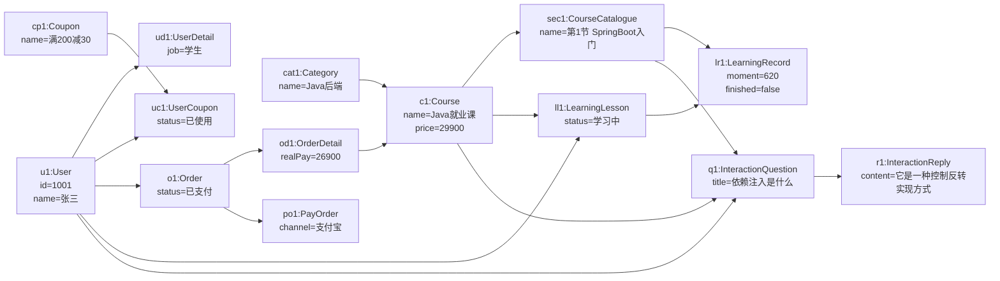

## 11. 系统主要类图

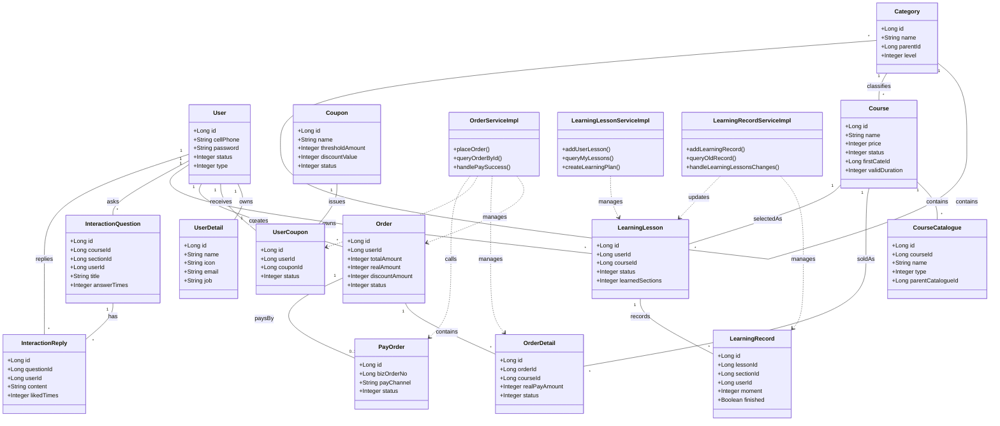

## 12. 论文写作建议

- 如果论文正文篇幅有限，正文优先放“总体功能结构图 + 顶层数据流图 + 第一层数据流图 + 核心 E-R 图 + 主要类图”。
- “用户端核心业务数据流图”和“实例图”更适合放在系统详细设计章节或附录中。
- 管理端功能图是根据项目说明和后台服务职责抽象得到，如果后续你补充了 `tj-admin` 前端源码，可再把具体菜单名称细化进去。
