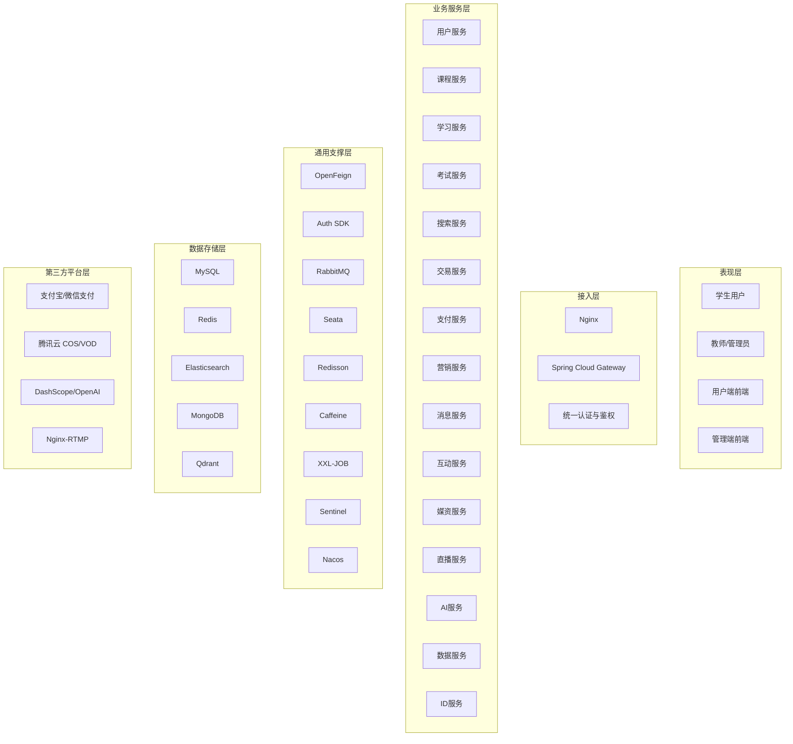
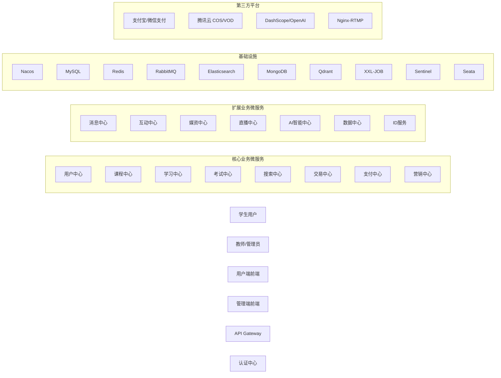
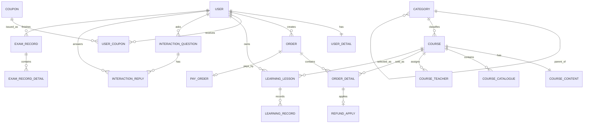
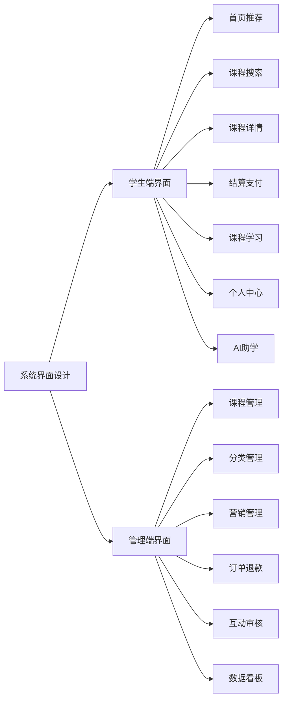
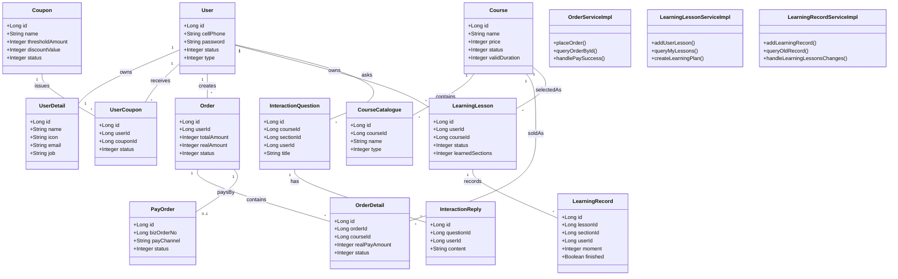

# 智慧MOOC教育平台毕业设计论文初稿

## 1 引言

### 1.1 选题目的和意义

随着互联网技术、云计算技术以及移动终端的不断普及，在线教育已经从传统的“视频播放”模式逐步发展为集课程学习、互动交流、学习监督、数据分析与智能推荐于一体的综合服务模式。特别是在职业技能培训领域，用户不仅关注课程内容本身，还更加关注平台是否能够提供完整的购课流程、学习计划、阶段测试、笔记问答、直播互动以及个性化推荐等能力。因此，设计并实现一个面向职业技能培训场景的智慧化在线教育平台，具有较强的现实意义。

本课题选择“智慧MOOC教育平台”作为毕业设计对象，目的在于构建一个覆盖课程售卖、课程学习、营销转化、用户互动、数据统计和 AI 助学等环节的综合在线教育系统。一方面，该系统能够提升在线教育平台的服务完整性和用户体验；另一方面，也能够通过微服务架构、缓存、消息队列、搜索引擎等技术手段，体现现代互联网应用系统的工程化设计思想。

从应用价值来看，本课题不仅可以服务于职业技能培训类平台的系统建设，也可为类似的在线课程平台、知识付费平台以及直播教学平台提供设计参考。从研究价值来看，本课题融合了微服务架构、分布式缓存、异步消息、搜索推荐以及 AI 智能交互等技术，具有较强的综合性，适合作为毕业设计研究对象。

### 1.2 研究应用现状、不足

目前，国内外在线教育平台已经较为普及，典型平台通常具备课程展示、用户注册登录、课程购买和视频在线播放等基础功能。部分成熟平台进一步引入了推荐算法、直播教学、学习打卡、智能客服等模块，从而提升了平台的竞争力。

但是，现有平台在实际应用中仍然存在以下不足：

1. 业务模块耦合较高。部分平台采用单体式系统架构，当课程、交易、支付、搜索等功能持续扩展时，系统维护成本会显著上升。
2. 学习闭环不完整。部分平台虽然支持课程播放，但在学习计划、学习记录、考试练习、互动问答等方面的整合程度不高，难以形成持续的学习监督机制。
3. 平台交互能力有限。传统在线教育系统主要围绕课程播放展开，在笔记、问答、消息通知、直播互动等方面支持不足，难以提升学习参与感。
4. 智能化水平不足。许多系统仍停留在课程展示和人工筛选阶段，缺少基于搜索推荐、智能问答和知识库检索的个性化服务能力。
5. 系统扩展性不足。面对营销活动、优惠券、分布式支付回调、直播推流等复杂业务场景时，若缺乏合理的系统架构，容易出现系统性能瓶颈与后续演进困难。

针对上述问题，本课题从系统架构、业务闭环和智能化能力三个方面进行优化，设计出一个更适合现代职业教育业务场景的智慧MOOC平台。

### 1.3 本课题的内容和价值

本课题围绕智慧MOOC教育平台的设计与实现展开，主要研究内容包括以下几个方面：

1. 设计一个面向学生用户与后台管理用户的综合在线教育平台，实现课程搜索、课程购买、学习记录、互动问答、优惠券营销、直播互动等核心功能。
2. 基于微服务架构对系统进行模块化拆分，将用户、课程、学习、交易、支付、营销、搜索、直播、AI、消息等业务划分为相互协作的服务模块。
3. 利用 Redis、RabbitMQ、Elasticsearch、MongoDB、Qdrant 等中间件提升系统在缓存、异步处理、搜索推荐和知识检索方面的能力。
4. 将 AI 功能接入在线教育场景，使平台具备智能问答、课程推荐、知识库检索和语音处理等扩展能力。
5. 基于典型业务场景对系统进行功能测试与分析，验证系统在实际教学与运营业务中的可行性。

本课题的应用价值主要体现在：能够实现课程运营与学习服务一体化，提升平台教学管理效率和学习体验；本课题的工程价值主要体现在：通过引入微服务和中间件支撑复杂业务场景，提升系统的扩展能力与维护能力；本课题的研究价值主要体现在：将现代互联网系统设计思想与在线教育业务深度结合，为类似系统的设计与开发提供借鉴。

### 1.4 技术路线

本课题采用“需求分析 -> 总体设计 -> 数据库设计 -> 关键功能实现 -> 系统测试验证”的技术路线。

在后端部分，系统基于 Java 17、Spring Boot 3.3.5 和 Spring Cloud Alibaba 2023.0.3.2 构建微服务体系，借助 Spring Cloud Gateway 进行统一接入，使用 Nacos 实现服务注册与配置管理。业务层采用 MyBatis-Plus 进行数据访问，通过 Redis 实现缓存和状态存储，通过 RabbitMQ 实现异步解耦，通过 Elasticsearch 提供课程搜索能力，通过 MongoDB 和 Qdrant 支撑 AI 会话与知识检索扩展。

在前端部分，系统采用 Vue3 + Vite + Pinia + Vue Router 构建用户端界面，实现课程展示、搜索、下单、支付、学习记录、互动问答等主要页面功能。管理端按照平台运营需求提供课程管理、营销管理、审核管理与数据统计能力。

在系统验证部分，选取课程搜索、优惠券下单、支付购课、学习记录和问答互动等关键业务作为测试对象，对系统功能正确性进行验证与分析。

## 2 系统需求分析

### 2.1 系统用户角色需求

智慧MOOC教育平台的主要使用对象包括学生用户、教师用户和后台管理员三类角色。

学生用户是平台的主要服务对象，其核心需求集中在课程发现、课程购买和课程学习三个方面。具体而言，学生用户需要能够完成账号注册与登录、浏览课程分类、搜索感兴趣的课程、查看课程详情、加入购物车、使用优惠券结算、完成在线支付、进入课程学习、记录学习进度、参与问答互动以及查看个人订单、积分和消息等操作。

教师用户主要承担课程内容维护和教学互动职能。教师用户需要能够配合后台完成课程内容配置、课程章节组织、题库维护、直播教学及学习问题答复等工作，从而支持平台教学内容的持续输出。

后台管理员主要面向平台运营和系统维护，其需求主要包括用户权限管理、课程分类管理、课程发布管理、媒资与直播配置、优惠券与营销活动管理、订单退款审批、问答审核以及数据统计分析等功能。管理员角色更关注平台整体运行效率和业务规范性。

### 2.2 系统功能需求分析

#### 2.2.1用户与权限服务
用户与权限服务是平台用于完成账号管理、身份认证和权限控制的基础功能模块。其中，学生用户、教师用户和后台管理员是系统中的三类主要角色，不同角色拥有不同的访问范围和操作权限。平台需要支持用户注册、登录、个人资料维护、角色分配和状态管理等操作，并在用户访问课程学习、后台管理、订单处理等功能时完成身份校验。对于后台管理人员，还要注意菜单权限、角色权限和数据权限之间的对应关系，以保证系统运行的安全性和规范性。

#### 2.2.2课程与分类管理服务
课程与分类管理服务是平台用于维护教学资源和课程内容的核心功能模块。其中，课程分类具有明确的层级关系，用于支撑课程筛选、检索和展示，管理员在添加、删除、修改和查询分类时，需要注意分类之间的父子关联和课程归属关系。课程管理功能支持课程基本信息维护、课程详情编辑、教师绑定、章节目录配置和课程上下架处理。管理员在发布课程时，需要维护课程封面、课程介绍、适用人群、课程目录和讲师信息；在课程状态管理中，还需要控制课程的草稿、上架和下架状态，以确保前台展示内容的准确性。

#### 2.2.3媒资管理服务
媒资管理服务是平台用于管理课程图片、视频和相关文件资源的功能模块。该模块支持课程封面上传、视频文件管理、媒资关联和资源存储，用于保障课程详情页、学习页和直播页的正常展示。管理员可以根据课程目录将视频资源与具体章节进行绑定，并对上传资源进行维护和替换。对于视频类资源，系统还需要支持点播播放、资源访问控制和媒资信息查询，以提升课程内容管理的效率。

#### 2.2.4搜索与推荐服务
搜索与推荐服务是平台用于提升课程发现效率的重要功能模块。用户可以通过关键词搜索、分类筛选和结果排序等方式查找目标课程，系统需要根据课程名称、分类信息和课程状态返回符合条件的课程结果。为了提高用户获取课程的效率，平台还应结合课程热度、用户浏览行为和学习兴趣生成推荐课程。对于已下架课程或未发布课程，系统在检索和展示时需要进行过滤，以保证搜索结果的有效性和一致性。

#### 2.2.5交易与订单服务
交易与订单服务是平台用于完成课程购买流程的关键功能模块。用户在浏览课程后，可以将课程加入购物车，进入结算页面确认购买课程和订单金额，并生成待支付订单。订单管理需要支持订单创建、订单明细记录、订单状态流转和订单查询等操作，同时要保证课程、订单和用户之间的数据对应关系。对于支付成功的订单，系统应自动更新状态并为用户生成对应课表；对于已提交退款申请的订单，还需要同步售后处理状态，确保交易流程完整闭环。

#### 2.2.6支付服务
支付服务是平台用于处理课程费用结算和支付结果回调的功能模块。系统需要支持支付单生成、支付渠道选择、支付状态查询和支付成功回调等业务流程。在用户完成支付时，平台要将订单信息和支付金额提交给第三方支付平台，并在收到支付结果后及时更新订单状态。对于退款业务，支付服务还需要与订单服务联动完成退款处理，并记录支付流水和退款流水，以保证账务数据的完整性与可追溯性。

#### 2.2.7营销优惠服务
营销优惠服务是平台用于提升课程转化率和运营效果的重要功能模块。该模块支持优惠券模板管理、优惠券领取、兑换码发放、优惠试算和下单核销等功能。管理员可以根据课程范围、使用门槛、折扣规则和发放时间配置优惠券活动，用户则可以在下单时选择满足条件的优惠券进行抵扣。对于高并发领券和优惠券核销场景，系统还需要注意优惠券库存、使用状态和适用范围之间的匹配关系，避免出现重复领取、超发或重复使用的问题。

#### 2.2.8学习管理服务
学习管理服务是平台用于组织用户学习过程和记录学习行为的核心模块。用户在购课成功后，系统会自动生成个人课表，用户可以在“我的课程”中查看已购课程、设置学习计划并进入课程学习页面。学习过程中，平台需要记录视频播放进度、章节完成状态、学习次数和学习时长等信息，并根据用户的学习情况更新课表状态。通过学习计划与学习记录的结合，平台能够形成从选课、开课到持续学习的完整学习闭环。

#### 2.2.9考试服务
考试服务是平台用于检验学习效果和辅助教学评价的功能模块。系统支持章节练习、测试题管理、考试记录保存和成绩统计等功能，用户在完成课程学习后可以参与对应的练习或考试。教师或管理员可以维护题目信息、题目分值和题目归属章节，系统则需要根据用户提交的答题结果完成判分和记录。考试结果应与课程学习数据关联，便于用户查看学习成果，也便于平台进行教学效果分析。

#### 2.2.10互动交流服务
互动交流服务是平台用于增强学习参与感和教学互动效果的重要模块。用户在学习过程中可以围绕课程章节发起提问、回复问题、发布笔记和进行点赞，从而形成课程学习场景下的互动链路。系统需要支持问题列表展示、回复内容管理、笔记保存和互动数据统计等功能，并注意问题、章节、课程和用户之间的关联关系。对于教师和管理员，还可以通过该模块查看互动内容并进行必要的审核与管理，以维护平台交流环境。

#### 2.2.11AI智能助学服务
AI智能助学服务是平台用于提升个性化学习体验和智能化水平的创新功能模块。该模块支持智能对话、知识库检索、课程推荐和语音处理等能力，能够为用户提供课程咨询、学习答疑和内容推荐服务。用户在学习过程中可以通过自然语言提问获取知识性回答，系统则根据课程内容、知识库数据和用户行为生成相应结果。为了保证回答质量，平台需要将 AI 功能与课程资源、知识文档和用户上下文信息结合起来，形成更加贴合教育场景的智能服务能力。

### 2.3 非功能需求分析

除功能需求外，系统还需要满足一定的非功能需求：

1. 可扩展性。系统采用微服务架构，使课程、学习、交易、支付、营销和 AI 等模块彼此解耦，便于后续功能扩展。
2. 性能要求。针对搜索、优惠券领取、支付回调、直播互动等高频业务，系统需要通过缓存、异步消息和分布式控制机制提高处理效率。
3. 可维护性。系统通过统一网关、统一认证、公共基础模块和模块化拆分降低后期维护与迭代成本。
4. 安全性。系统应具备身份认证、权限控制、接口鉴权、支付回调校验及关键业务操作保护能力。
5. 可用性。系统应保证主要业务流程稳定可用，在课程购买、学习记录与消息提醒等关键场景中具有较好的用户体验。

### 2.4 数据需求分析

从业务需求出发，系统数据主要围绕“用户、课程、交易、学习、互动、营销”六个核心主题展开。

1. 用户数据。包括用户基础信息、扩展资料、角色与权限等内容，用于支撑登录、个人中心和后台权限控制。
2. 课程数据。包括课程分类、课程主体信息、课程详情、课程章节目录、教师信息等内容，用于支撑课程展示、搜索和学习。
3. 交易数据。包括购物车、订单、订单明细、支付单、退款申请等内容，用于支撑课程购买和支付流程。
4. 学习数据。包括课表、学习记录、学习计划、考试记录和成绩信息，用于支撑学习监督和结果反馈。
5. 互动数据。包括问题、回复、笔记、点赞和消息通知等内容，用于支撑学习交流和社区互动。
6. 营销数据。包括优惠券模板、用户优惠券、兑换码和活动规则等内容，用于支撑平台促销和下单优惠。

上述数据主题之间存在明确的业务关系，例如用户购买课程后会形成订单数据和课表数据，用户学习课程会产生学习记录数据，用户在学习过程中又会生成互动数据，因此数据库设计需要围绕这些核心主题展开统一建模。

## 3 系统总体设计

### 3.1 系统软件层次架构设计

为了清晰描述系统从用户访问到业务处理再到底层资源支撑的整体关系，本文将系统划分为表现层、接入层、业务服务层、通用支撑层、数据存储层和第三方平台层。系统层次架构图如图所示。

在该架构中，表现层负责与用户直接交互；接入层负责统一入口、路由转发与权限校验；业务服务层承载平台主要业务逻辑；通用支撑层为微服务提供服务通信、消息解耦、事务控制、缓存与调度等能力；数据存储层负责关系型、缓存型、检索型和文档型数据存储；第三方平台层则支撑支付、云存储、AI 与直播等扩展能力。

从系统工程实现角度出发，平台采用微服务拆分方式组织后端业务。微服务架构图如图所示。

在该设计中，`tj-gateway` 负责对外统一接入，`tj-auth` 负责认证授权，`tj-user`、`tj-course`、`tj-learning`、`tj-trade`、`tj-pay`、`tj-promotion`、`tj-search` 等服务共同构成平台核心业务链路，`tj-message`、`tj-live`、`tj-aigc`、`tj-data` 等服务则提供扩展业务与支撑能力。此种设计既保证了服务职责清晰，也为后续扩展新业务提供了良好的基础。

### 3.2 数据库设计

本系统数据库设计遵循“结构清晰、业务驱动、便于扩展”的原则。数据库设计主要围绕智慧MOOC教育平台中的课程组织、用户购课、支付结算、学习记录、互动交流和营销活动等核心业务展开。在数据库实现上，系统以 MySQL 作为核心关系型数据存储，同时结合 Redis、Elasticsearch、MongoDB 与 Qdrant 作为缓存、搜索与智能检索的辅助存储组件。根据论文写作结构要求，本文将数据库设计分为 E-R 图设计、数据库关系模型和数据库表具体设计三部分进行说明。

#### 3.2.1 E-R图设计

在概念结构设计阶段，首先需要根据系统的业务流程抽象出主要实体，并分析实体之间的联系。智慧MOOC教育平台中的核心实体主要包括用户、用户详情、课程分类、课程、课程内容、课程目录、订单、订单明细、支付单、优惠券、用户优惠券、学习课表、学习记录、互动问题、互动回复和考试记录等。

从业务逻辑上看，用户与用户详情之间是一对一关系；课程分类与课程之间是一对多关系；课程与课程目录之间是一对多关系；用户与订单之间是一对多关系；订单与订单明细之间是一对多关系；订单与支付单之间是一对一关系；用户与学习课表之间是一对多关系；学习课表与学习记录之间是一对多关系；用户与互动问题、互动回复之间也都存在一对多关系。上述实体共同构成了“用户选课购课 - 支付结算 - 学习记录 - 互动问答 - 考试评价”的主业务链路，其 E-R 图设计如图所示。

#### 3.2.2 数据库关系模型

数据库逻辑结构设计的主要任务是将概念设计阶段提出的实体模型转换为关系模型。在关系模型设计过程中，各实体均以关系模式表示，主键通常以下划线标识。结合智慧MOOC教育平台的业务需求，可以得到如下主要关系模式：

(1)用户：_用户ID_，用户名，手机号，密码，用户类型，状态，微信唯一标识，创建时间，更新时间，创建人，更新人。

(2)用户详情：_用户ID_，姓名，昵称，头像，性别，生日，职业，简介，邮箱，积分，成长值，角色ID。

(3)课程分类：_分类ID_，分类名称，父分类ID，分类层级，排序值，状态，创建时间，更新时间。

(4)课程：_课程ID_，课程名称，一级分类ID，二级分类ID，三级分类ID，课程类型，课程价格，有效期，课程状态，课程封面，购买截止时间，章节数量，创建时间，更新时间。

(5)课程内容：_内容ID_，课程ID，课程介绍，适用人群，课程详情，创建时间，更新时间。

(6)课程目录：_目录ID_，课程ID，目录名称，目录类型，父目录ID，排序序号，媒资ID，视频时长，创建时间，更新时间。

(7)订单：_订单ID_，用户ID，支付单号，订单总金额，优惠金额，实付金额，订单状态，支付方式，订单说明，创建时间，支付时间，关闭时间，退款时间。

(8)订单明细：_订单明细ID_，订单ID，用户ID，课程ID，课程名称，课程封面，课程价格，优惠金额，实付金额，有效期，订单状态，退款状态。

(9)支付单：_支付单编号_，业务订单号，业务用户ID，支付渠道编码，支付金额，支付状态，创建时间，更新时间。

(10)优惠券：_优惠券ID_，优惠券名称，折扣类型，折扣值，使用门槛，总数量，已发放数量，每人限领数量，获取方式，发放开始时间，发放结束时间，状态。

(11)用户优惠券：_用户优惠券ID_，用户ID，优惠券ID，生效时间，失效时间，使用状态，创建时间，更新时间。

(12)学习课表：_课表ID_，用户ID，课程ID，学习状态，已学习小节数，最近学习小节ID，最近学习时间，每周学习频率，计划状态，过期时间，创建时间，更新时间。

(13)学习记录：_学习记录ID_，课表ID，小节ID，用户ID，学习进度，是否完成，完成时间，创建时间，更新时间。

(14)互动问题：_问题ID_，课程ID，章节ID，小节ID，用户ID，标题，问题描述，回答次数，浏览次数，是否匿名，是否隐藏，创建时间，更新时间。

(15)互动回复：_回复ID_，问题ID，回答ID，用户ID，回复内容，点赞数，是否匿名，是否隐藏，创建时间，更新时间。

(16)笔记：_笔记ID_，用户ID，课程ID，章节ID，小节ID，笔记内容，记录时间点，是否公开，是否采集，是否隐藏，创建时间，更新时间。

(17)考试记录：_考试记录ID_，用户ID，课程ID，小节ID，考试类型，得分，是否完成，提交时间，创建时间，更新时间。

以上关系模式覆盖了本系统课程管理、交易支付、学习管理、互动交流和营销活动等核心业务，为后续数据库表设计和系统实现提供了逻辑基础。

#### 3.2.3 数据库表具体设计

智慧MOOC教育平台涉及用户管理、课程管理、交易支付、学习记录、互动问答和营销活动等多个功能模块，因此数据库表设计相对复杂。在数据库表设计过程中，需要重点考虑字段名、数据类型、长度、是否为空、是否为主键等要素。字段命名应尽量准确清晰，数据类型需要与字段含义相匹配，长度设置应满足实际业务需求。由于本系统采用微服务架构，不同业务模块的数据通常存储在不同服务中，因此数据库设计中一般不设置外键约束，以减少跨库关联操作的复杂性，并通过业务层保证数据一致性。

用户表主要描述用户账号的基础信息，如表 3-1 所示。

表 3-1 用户表

| 名称 | 解释 | 数据类型 | 长度 | 是否为主键 | 可为空 |
| --- | --- | --- | --- | --- | --- |
| id | 用户id | bigint | 20 | Y | N |
| username | 用户名 | varchar | 32 | N | Y |
| password | 密码 | varchar | 64 | N | Y |
| cell_phone | 手机号码 | varchar | 20 | N | Y |
| type | 用户类型 | int | 11 | N | Y |
| status | 用户状态 | int | 11 | N | Y |
| wx_unionid | 微信唯一标识 | varchar | 255 | N | Y |
| create_time | 注册时间 | datetime | - | N | Y |
| update_time | 更新时间 | datetime | - | N | Y |
| creater | 创建人 | varchar | 64 | N | Y |
| updater | 更新人 | varchar | 64 | N | Y |

课程分类表用于描述课程分类层级信息，如表 3-2 所示。

表 3-2 课程分类表

| 名称 | 解释 | 数据类型 | 长度 | 是否为主键 | 可为空 |
| --- | --- | --- | --- | --- | --- |
| id | 分类id | bigint | 20 | Y | N |
| name | 分类名称 | varchar | 64 | N | N |
| parent_id | 父分类id | bigint | 20 | N | N |
| level | 分类层级 | int | 11 | N | N |
| priority | 排序值 | int | 11 | N | Y |
| status | 启用状态 | int | 11 | N | Y |
| create_time | 创建时间 | datetime | - | N | Y |
| update_time | 更新时间 | datetime | - | N | Y |

课程表用于描述平台中可售卖和学习的课程主体信息，如表 3-3 所示。

表 3-3 课程表

| 名称 | 解释 | 数据类型 | 长度 | 是否为主键 | 可为空 |
| --- | --- | --- | --- | --- | --- |
| id | 课程id | bigint | 20 | Y | N |
| name | 课程名称 | varchar | 128 | N | N |
| first_cate_id | 一级分类id | bigint | 20 | N | Y |
| second_cate_id | 二级分类id | bigint | 20 | N | Y |
| third_cate_id | 三级分类id | bigint | 20 | N | Y |
| course_type | 课程类型 | tinyint | 4 | N | Y |
| price | 课程价格 | int | 11 | N | Y |
| status | 课程状态 | tinyint | 4 | N | Y |
| valid_duration | 有效期（月） | int | 11 | N | Y |
| cover_url | 课程封面 | varchar | 255 | N | Y |
| section_num | 小节数量 | int | 11 | N | Y |
| purchase_end_time | 购买截止时间 | datetime | - | N | Y |
| create_time | 创建时间 | datetime | - | N | Y |
| update_time | 更新时间 | datetime | - | N | Y |

订单表用于描述用户下单后的订单主信息，如表 3-4 所示。

表 3-4 订单表

| 名称 | 解释 | 数据类型 | 长度 | 是否为主键 | 可为空 |
| --- | --- | --- | --- | --- | --- |
| id | 订单id | bigint | 20 | Y | N |
| user_id | 用户id | bigint | 20 | N | N |
| pay_order_no | 支付单号 | bigint | 20 | N | Y |
| total_amount | 订单总金额 | int | 11 | N | Y |
| discount_amount | 优惠金额 | int | 11 | N | Y |
| real_amount | 实付金额 | int | 11 | N | Y |
| status | 订单状态 | int | 11 | N | Y |
| pay_channel | 支付方式 | int | 11 | N | Y |
| message | 订单说明 | varchar | 255 | N | Y |
| create_time | 创建时间 | datetime | - | N | Y |
| pay_time | 支付时间 | datetime | - | N | Y |
| close_time | 关闭时间 | datetime | - | N | Y |
| refund_time | 退款时间 | datetime | - | N | Y |

订单明细表用于描述订单中的课程明细信息，如表 3-5 所示。

表 3-5 订单明细表

| 名称 | 解释 | 数据类型 | 长度 | 是否为主键 | 可为空 |
| --- | --- | --- | --- | --- | --- |
| id | 订单明细id | bigint | 20 | Y | N |
| order_id | 订单id | bigint | 20 | N | N |
| user_id | 用户id | bigint | 20 | N | N |
| course_id | 课程id | bigint | 20 | N | N |
| name | 课程名称 | varchar | 128 | N | Y |
| cover_url | 课程封面 | varchar | 255 | N | Y |
| price | 课程原价 | int | 11 | N | Y |
| discount_amount | 优惠金额 | int | 11 | N | Y |
| real_pay_amount | 实付金额 | int | 11 | N | Y |
| valid_duration | 有效期 | int | 11 | N | Y |
| status | 明细状态 | int | 11 | N | Y |
| refund_status | 退款状态 | int | 11 | N | Y |

学习课表表主要描述用户购课后形成的学习课程信息，如表 3-6 所示。

表 3-6 学习课表表

| 名称 | 解释 | 数据类型 | 长度 | 是否为主键 | 可为空 |
| --- | --- | --- | --- | --- | --- |
| id | 课表id | bigint | 20 | Y | N |
| user_id | 用户id | bigint | 20 | N | N |
| course_id | 课程id | bigint | 20 | N | N |
| status | 学习状态 | int | 11 | N | Y |
| learned_sections | 已学小节数 | int | 11 | N | Y |
| latest_section_id | 最近学习小节id | bigint | 20 | N | Y |
| latest_learn_time | 最近学习时间 | datetime | - | N | Y |
| week_freq | 每周学习频率 | int | 11 | N | Y |
| plan_status | 学习计划状态 | int | 11 | N | Y |
| expire_time | 到期时间 | datetime | - | N | Y |
| create_time | 创建时间 | datetime | - | N | Y |
| update_time | 更新时间 | datetime | - | N | Y |

学习记录表用于保存用户在课程学习过程中的进度信息，如表 3-7 所示。

表 3-7 学习记录表

| 名称 | 解释 | 数据类型 | 长度 | 是否为主键 | 可为空 |
| --- | --- | --- | --- | --- | --- |
| id | 学习记录id | bigint | 20 | Y | N |
| lesson_id | 课表id | bigint | 20 | N | N |
| section_id | 小节id | bigint | 20 | N | N |
| user_id | 用户id | bigint | 20 | N | N |
| moment | 学习进度 | int | 11 | N | Y |
| finished | 是否完成 | tinyint | 4 | N | Y |
| finish_time | 完成时间 | datetime | - | N | Y |
| create_time | 创建时间 | datetime | - | N | Y |
| update_time | 更新时间 | datetime | - | N | Y |

优惠券表用于描述平台营销活动中的优惠券规则信息，如表 3-8 所示。

表 3-8 优惠券表

| 名称 | 解释 | 数据类型 | 长度 | 是否为主键 | 可为空 |
| --- | --- | --- | --- | --- | --- |
| id | 优惠券id | bigint | 20 | Y | N |
| name | 优惠券名称 | varchar | 128 | N | N |
| discount_type | 折扣类型 | int | 11 | N | Y |
| discount_value | 折扣值 | int | 11 | N | Y |
| threshold_amount | 使用门槛 | int | 11 | N | Y |
| total_num | 发放总量 | int | 11 | N | Y |
| issue_num | 已发放数量 | int | 11 | N | Y |
| user_limit | 每人限领数量 | int | 11 | N | Y |
| obtain_way | 获取方式 | int | 11 | N | Y |
| issue_begin_time | 发放开始时间 | datetime | - | N | Y |
| issue_end_time | 发放结束时间 | datetime | - | N | Y |
| status | 优惠券状态 | int | 11 | N | Y |

### 3.3 系统的界面设计

系统界面设计遵循“功能清晰、流程顺畅、角色分明”的原则，并根据学生用户和后台管理用户的不同使用场景进行界面划分。

对于学生用户，平台界面以课程消费与学习过程为主线，重点页面包括：首页推荐页、课程搜索页、课程详情页、购物车与结算页、支付页、学习页、个人中心页以及 AI 助学页。首页强调课程推荐和分类导航，搜索页强调条件筛选与结果展示，学习页强调目录、视频、问答与笔记联动，个人中心则集中展示课程、订单、优惠券、消息与积分等信息。

对于后台管理用户，界面设计强调运营效率与管理便利性，重点页面包括：课程管理页面、分类管理页面、营销活动配置页面、订单退款管理页面、互动审核页面和数据看板页面。其中，课程管理页面用于维护课程信息与章节结构，营销活动配置页面用于管理优惠券模板与活动规则，数据看板页面用于展示平台运营统计数据。

系统主要界面结构可概括为如下形式：

### 3.4 系统主要类的设计

为了描述系统核心对象及其关系，本文选取课程、订单、优惠券、学习记录和互动问答等主要业务对象进行类设计。系统主要类图如图所示。

其中，`OrderServiceImpl` 负责订单创建、优惠计算与支付成功后的订单状态变更；`LearningLessonServiceImpl` 负责课表生成和学习计划管理；`LearningRecordServiceImpl` 负责学习进度写入与课表状态更新。该设计体现了系统在详细实现中“实体对象 + 业务服务类”相分离的设计思想。

## 4 系统实现

### 4.1 系统环境搭建

本系统采用前后端分离的开发模式，后端运行环境基于 Java 17、Maven 和 Spring Boot 3.3.5，前端运行环境基于 Node.js、Vue3 和 Vite。系统部署过程中还依赖 Nacos、MySQL、Redis、RabbitMQ、Elasticsearch、XXL-JOB 等中间件。

后端聚合工程通过 Maven 多模块方式进行管理，核心模块包括 `tj-auth`、`tj-user`、`tj-course`、`tj-learning`、`tj-trade`、`tj-pay`、`tj-promotion`、`tj-search`、`tj-live`、`tj-aigc` 等。前端用户端工程采用 Vue3、Pinia 和 Vue Router 实现页面组织与状态管理。

在环境搭建过程中，需要首先准备基础运行环境与中间件服务，再分别启动 Nacos、数据库、缓存和消息队列，最后启动网关与业务微服务。前端通过 `npm install` 安装依赖，使用 `vite` 启动开发环境，从而实现用户端页面调试与联调。

### 4.2 微服务基础组件

在系统实现过程中，微服务基础组件是保障平台稳定运行的核心支撑。本文重点选取统一网关与认证、服务注册与配置、缓存与异步消息三个方面进行说明。

1. 统一网关与认证。系统通过 `tj-gateway` 作为统一入口，负责请求路由、接口过滤和资源访问控制；通过 `tj-auth` 实现统一登录与鉴权，从而降低各业务服务重复处理认证逻辑的成本。
2. 服务注册与配置中心。系统通过 Nacos 实现服务注册发现与配置统一管理，各微服务启动后能够在 Nacos 中完成服务注册，并读取公共配置文件，提升系统配置管理效率。
3. 缓存与异步消息。系统通过 Redis 实现热点数据缓存、状态存储与分布式控制，通过 RabbitMQ 实现订单支付、学习开课、消息通知、搜索索引更新等异步业务解耦，提升系统性能与扩展能力。
4. 分布式事务与容错控制。系统通过 Seata 处理跨服务事务一致性问题，通过 Sentinel 提供限流与熔断能力，通过 XXL-JOB 支撑定时任务和数据统计任务。

### 4.3 后端管理系统

考虑到毕业设计论文篇幅限制，本文只选取后台管理系统中的三个代表性功能进行实现说明，分别为课程发布管理、优惠券营销管理和订单退款管理。

#### 4.3.1 课程发布管理实现

课程发布管理是后台管理系统中的核心功能之一。管理员需要维护课程基础信息、课程封面、课程介绍、课程目录和教师信息，并控制课程的上架与下架状态。系统后端通过课程中心服务完成课程数据的增删改查与目录维护，在课程状态发生变化时，还会同步更新搜索中心中的课程索引，以保证前台搜索结果的实时性。

#### 4.3.2 优惠券营销管理实现

营销中心负责优惠券模板管理、用户领券、优惠试算和下单核销等逻辑。在具体实现中，系统先根据订单中的课程信息计算总金额，再结合优惠券门槛与折扣规则完成优惠试算，最后在创建订单时记录优惠金额并完成优惠券状态更新。对于高并发领券场景，系统通过 Redis 和异步消息机制降低数据库压力。

#### 4.3.3 订单退款管理实现

订单退款管理主要包括退款申请、退款审批和退款状态更新三个环节。用户提出退款申请后，交易中心记录退款申请单，后台管理员在管理系统中进行审批；审批通过后，支付中心与第三方支付平台协同处理退款，并将退款结果同步回订单状态。该功能体现了交易服务与支付服务之间的协同工作机制。

### 4.4 前端界面实现

前端界面实现部分同样不对所有页面逐一展开，而是选取与主业务链最相关的三个页面进行说明，分别为课程搜索页、结算支付页和课程学习页。

#### 4.4.1 课程搜索页实现

课程搜索页主要负责展示课程检索结果，并支持关键词搜索、分类筛选和排序切换。页面通过调用搜索服务接口获取课程列表，再将课程数据以卡片形式展示给用户，从而帮助用户快速找到目标课程。

#### 4.4.2 结算支付页实现

结算支付页主要负责展示待购买课程、优惠券选择结果和订单支付信息。用户在该页面确认课程信息后，可以选择可用优惠券完成优惠试算，并在支付成功后跳转到结果页。该页面是用户端交易流程中的关键入口。

#### 4.4.3 课程学习页实现

课程学习页是系统前端实现中最重要的页面之一。该页面将视频播放、课程目录、笔记记录、问题提问和学习进度记录等功能整合到同一学习场景中。用户在观看视频时，系统能够同步记录学习进度，并支持基于课程章节进行问答互动，从而形成完整的学习闭环。

## 5 系统测试

### 5.1 系统功能测试与分析

为了验证系统设计与实现的正确性，本文选取课程搜索、优惠券下单、支付购课、学习记录和问答互动五个核心功能进行功能测试。测试环境基于本地前后端联调环境与虚拟机中间件环境搭建，测试结果重点关注功能正确性、流程完整性和业务数据一致性。

系统功能测试用例如下表所示：

| 测试编号 | 测试功能 | 测试内容 | 预期结果 | 测试结果 |
| --- | --- | --- | --- | --- |
| T1 | 课程搜索 | 输入关键词并进行分类筛选 | 正确返回符合条件的课程列表 | 通过 |
| T2 | 优惠券下单 | 选择课程并使用可用优惠券结算 | 正确计算优惠金额并生成待支付订单 | 通过 |
| T3 | 支付购课 | 完成订单支付 | 订单状态更新为已支付，自动生成课表 | 通过 |
| T4 | 学习记录 | 播放课程视频并退出页面 | 正确记录学习进度并更新学习状态 | 通过 |
| T5 | 问答互动 | 发布问题并进行回复 | 正确保存问题与回复，并显示在页面中 | 通过 |

从测试结果来看，系统在主要业务场景下均能够达到预期目标。

1. 在课程搜索测试中，系统能够根据关键词和分类条件快速返回课程列表，说明搜索服务与课程服务之间的数据同步机制有效。
2. 在优惠券下单测试中，系统能够正确识别优惠券适用条件并计算实际支付金额，说明营销中心与交易中心之间的协同逻辑正常。
3. 在支付购课测试中，系统能够在支付成功后自动更新订单状态并生成学习课表，说明交易中心、支付中心和学习中心之间的异步联动机制有效。
4. 在学习记录测试中，系统能够正确记录用户学习进度，并在课程学习页面中完成状态回显，说明学习记录功能实现正确。
5. 在问答互动测试中，系统能够完成问题发布、回复提交和结果展示，说明互动功能能够满足课程学习过程中的交流需求。

综合测试结果可以看出，智慧MOOC教育平台已经能够满足在线课程平台的核心业务需求，并且在课程搜索、交易支付、学习监督和互动交流等方面具有较好的可用性与稳定性。由于篇幅限制，本文未对全部功能进行逐项测试，但所选取的关键功能已经覆盖了平台主业务链路，能够较好地说明系统实现的有效性。
